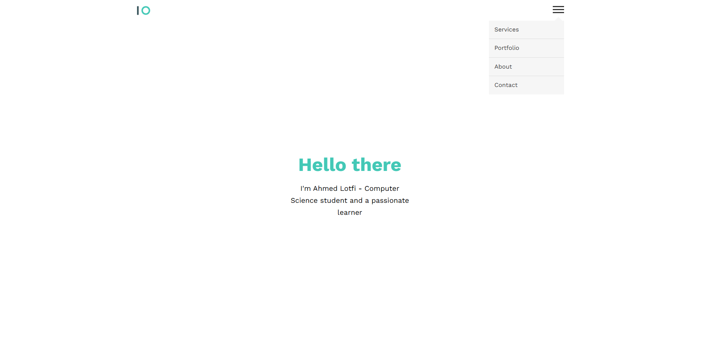
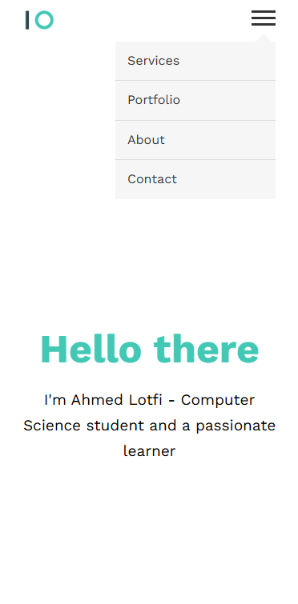

# Simple Landing Page

This is a clean and responsive landing page built using **HTML, CSS, and JavaScript**. It consists of five main sections: **Home, Services, Portfolio, About, and Contact**.

## 🚀 Features

- **Fully Responsive Design** – Works on all devices.
- **Smooth Scrolling Navigation** – Easy navigation between sections.
- **Modern UI** – Clean and elegant design.
- **Contact Form** – Simple and functional.

## 🛠️ Tech Stack

- **HTML** – Structure and content
- **CSS** – Styling and layout
- **JavaScript** – Smooth scrolling and interactivity

## 📸 Screenshots

- 
- 

## 📂 Project Setup

1. Clone the repository:
   ```bash
   git clone https://github.com/yourusername/Elzero-First-Design.git
   ```
2. Navigate to the project directory:
   ```bash
   cd simple-landing-page
   ```
3. Open the `index.html` file in your browser.

## 📬 Contact

For any inquiries or improvements, feel free to reach out at [ahmedmlotfi@outlook.com/contact info].

---

Made with ❤️ by Ahmed Lotfi
